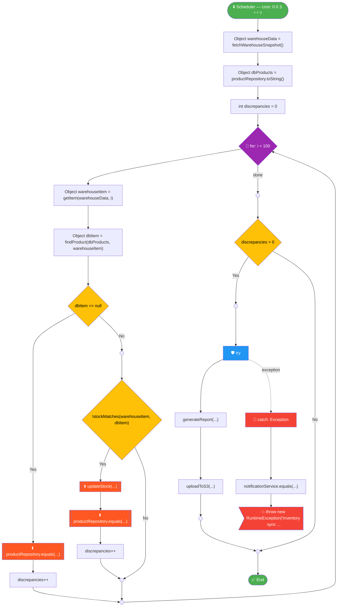

# InventoryScheduler.syncInventory()

**Type:** Scheduler  
**Endpoint:** `cron: 0 0 3 * * ?`  
**Outbound:** productRepository.equals(...), updateStock(...)  

```mermaid
flowchart TD
    N1(["⬇️ Scheduler — cron: 0 0 3 * * ?"])
    style N1 fill:#4CAF50,color:#fff
    N2["Object warehouseData = fetchWarehouseSnapshot()"]
    N1 --> N2
    N3["Object dbProducts = productRepository.toString()"]
    N2 --> N3
    N4["int discrepancies = 0"]
    N3 --> N4
    N5{"🔁 for: i < 100"}
    style N5 fill:#9C27B0,color:#fff
    N4 --> N5
    N6["Object warehouseItem = getItem(warehouseData, i)"]
    N5 --> N6
    N7["Object dbItem = findProduct(dbProducts, warehouseItem)"]
    N6 --> N7
    N8{"dbItem == null"}
    style N8 fill:#FFC107,color:#000
    N7 --> N8
    N9((" "))
    N10[["⬆️ productRepository.equals(...)"]]
    style N10 fill:#FF5722,color:#fff
    N8 -->|Yes| N10
    N11["discrepancies++"]
    N10 --> N11
    N11 --> N9
    N12((" "))
    N8 -->|No| N12
    N13{"!stockMatches(warehouseItem, dbItem)"}
    style N13 fill:#FFC107,color:#000
    N12 --> N13
    N14((" "))
    N15[["⬆️ updateStock(...)"]]
    style N15 fill:#FF5722,color:#fff
    N13 -->|Yes| N15
    N16[["⬆️ productRepository.equals(...)"]]
    style N16 fill:#FF5722,color:#fff
    N15 --> N16
    N17["discrepancies++"]
    N16 --> N17
    N17 --> N14
    N13 -->|No| N14
    N14 --> N9
    N9 --> N5
    N18((" "))
    N5 -->|done| N18
    N19{"discrepancies > 0"}
    style N19 fill:#FFC107,color:#000
    N18 --> N19
    N20((" "))
    N21((" "))
    N19 -->|Yes| N21
    N22["🛡️ try"]
    style N22 fill:#2196F3,color:#fff
    N21 --> N22
    N23((" "))
    N24["generateReport(...)"]
    N22 --> N24
    N25["uploadToS3(...)"]
    N24 --> N25
    N25 --> N23
    N26["🚨 catch: Exception"]
    style N26 fill:#f44336,color:#fff
    N22 -.->|exception| N26
    N27["notificationService.equals(...)"]
    N26 --> N27
    N28>"💥 throw new RuntimeException('Inventory sync ..."]
    style N28 fill:#f44336,color:#fff
    N27 --> N28
    N23 --> N20
    N19 -->|No| N20
    N29(["✅ End"])
    style N29 fill:#4CAF50,color:#fff
    N20 --> N29

    %% Auto-detected outbound systems:
    %% → productRepository.equals(...)
    %% → updateStock(...)
```
