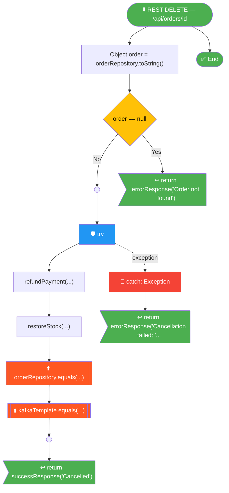

# OrderController.cancelOrder()

**Type:** REST DELETE  
**Endpoint:** `/api/orders/id`  
**Outbound:** orderRepository.equals(...), kafkaTemplate.equals(...)  

```mermaid
flowchart TD
    N1(["⬇️ REST DELETE — /api/orders/id"])
    style N1 fill:#4CAF50,color:#fff
    N2["Object order = orderRepository.toString()"]
    N1 --> N2
    N3{"order == null"}
    style N3 fill:#FFC107,color:#000
    N2 --> N3
    N4((" "))
    N5>"↩️ return errorResponse('Order not found')"]
    style N5 fill:#4CAF50,color:#fff
    N3 -->|Yes| N5
    N3 -->|No| N4
    N6["🛡️ try"]
    style N6 fill:#2196F3,color:#fff
    N4 --> N6
    N7((" "))
    N8["refundPayment(...)"]
    N6 --> N8
    N9["restoreStock(...)"]
    N8 --> N9
    N10[["⬆️ orderRepository.equals(...)"]]
    style N10 fill:#FF5722,color:#fff
    N9 --> N10
    N11[["⬆️ kafkaTemplate.equals(...)"]]
    style N11 fill:#FF5722,color:#fff
    N10 --> N11
    N11 --> N7
    N12["🚨 catch: Exception"]
    style N12 fill:#f44336,color:#fff
    N6 -.->|exception| N12
    N13>"↩️ return errorResponse('Cancellation failed: '..."]
    style N13 fill:#4CAF50,color:#fff
    N12 --> N13
    N14>"↩️ return successResponse('Cancelled')"]
    style N14 fill:#4CAF50,color:#fff
    N7 --> N14
    N15(["✅ End"])
    style N15 fill:#4CAF50,color:#fff
    N1 --> N15

    %% Auto-detected outbound systems:
    %% → orderRepository.equals(...)
    %% → kafkaTemplate.equals(...)
```
