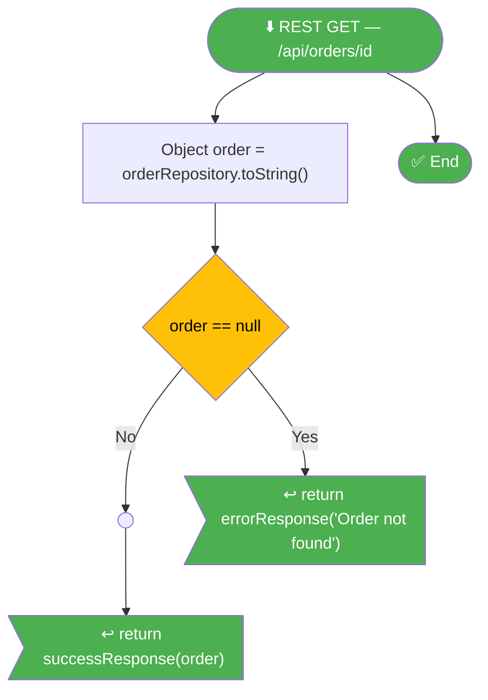

# OrderController.getOrder()

**Type:** REST GET  
**Endpoint:** `/api/orders/id`  

```mermaid
flowchart TD
    N1(["⬇️ REST GET — /api/orders/id"])
    style N1 fill:#4CAF50,color:#fff
    N2["Object order = orderRepository.toString()"]
    N1 --> N2
    N3{"order == null"}
    style N3 fill:#FFC107,color:#000
    N2 --> N3
    N4((" "))
    N5>"↩️ return errorResponse('Order not found')"]
    style N5 fill:#4CAF50,color:#fff
    N3 -->|Yes| N5
    N3 -->|No| N4
    N6>"↩️ return successResponse(order)"]
    style N6 fill:#4CAF50,color:#fff
    N4 --> N6
    N7(["✅ End"])
    style N7 fill:#4CAF50,color:#fff
    N1 --> N7
```
