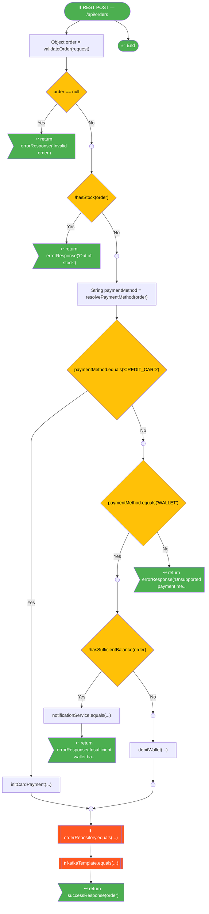

# OrderController.placeOrder()

**Type:** REST POST  
**Endpoint:** `/api/orders`  
**Outbound:** orderRepository.equals(...), kafkaTemplate.equals(...)  

```mermaid
flowchart TD
    N1(["⬇️ REST POST — /api/orders"])
    style N1 fill:#4CAF50,color:#fff
    N2["Object order = validateOrder(request)"]
    N1 --> N2
    N3{"order == null"}
    style N3 fill:#FFC107,color:#000
    N2 --> N3
    N4((" "))
    N5>"↩️ return errorResponse('Invalid order')"]
    style N5 fill:#4CAF50,color:#fff
    N3 -->|Yes| N5
    N3 -->|No| N4
    N6{"!hasStock(order)"}
    style N6 fill:#FFC107,color:#000
    N4 --> N6
    N7((" "))
    N8>"↩️ return errorResponse('Out of stock')"]
    style N8 fill:#4CAF50,color:#fff
    N6 -->|Yes| N8
    N6 -->|No| N7
    N9["String paymentMethod = resolvePaymentMethod(order)"]
    N7 --> N9
    N10{"paymentMethod.equals('CREDIT_CARD')"}
    style N10 fill:#FFC107,color:#000
    N9 --> N10
    N11((" "))
    N12["initCardPayment(...)"]
    N10 -->|Yes| N12
    N12 --> N11
    N13((" "))
    N10 -->|No| N13
    N14{"paymentMethod.equals('WALLET')"}
    style N14 fill:#FFC107,color:#000
    N13 --> N14
    N15((" "))
    N16((" "))
    N14 -->|Yes| N16
    N17{"!hasSufficientBalance(order)"}
    style N17 fill:#FFC107,color:#000
    N16 --> N17
    N18((" "))
    N19["notificationService.equals(...)"]
    N17 -->|Yes| N19
    N20>"↩️ return errorResponse('Insufficient wallet ba..."]
    style N20 fill:#4CAF50,color:#fff
    N19 --> N20
    N17 -->|No| N18
    N21["debitWallet(...)"]
    N18 --> N21
    N21 --> N15
    N22>"↩️ return errorResponse('Unsupported payment me..."]
    style N22 fill:#4CAF50,color:#fff
    N14 -->|No| N22
    N15 --> N11
    N23[["⬆️ orderRepository.equals(...)"]]
    style N23 fill:#FF5722,color:#fff
    N11 --> N23
    N24[["⬆️ kafkaTemplate.equals(...)"]]
    style N24 fill:#FF5722,color:#fff
    N23 --> N24
    N25>"↩️ return successResponse(order)"]
    style N25 fill:#4CAF50,color:#fff
    N24 --> N25
    N26(["✅ End"])
    style N26 fill:#4CAF50,color:#fff
    N1 --> N26

    %% Auto-detected outbound systems:
    %% → orderRepository.equals(...)
    %% → kafkaTemplate.equals(...)
```
