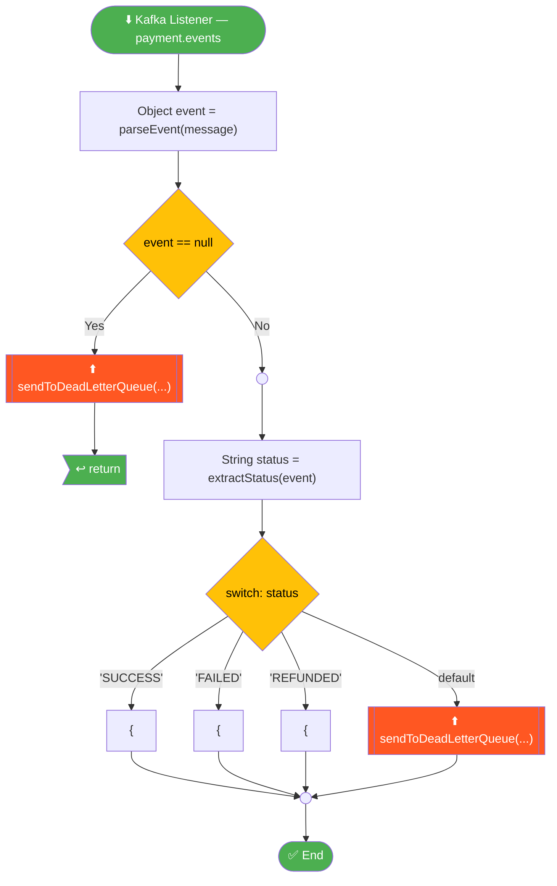

# PaymentEventListener.onPaymentEvent()

**Type:** Kafka Listener  
**Endpoint:** `payment.events`  
**Outbound:** sendToDeadLetterQueue(...)  

```mermaid
flowchart TD
    N1(["⬇️ Kafka Listener — payment.events"])
    style N1 fill:#4CAF50,color:#fff
    N2["Object event = parseEvent(message)"]
    N1 --> N2
    N3{"event == null"}
    style N3 fill:#FFC107,color:#000
    N2 --> N3
    N4((" "))
    N5[["⬆️ sendToDeadLetterQueue(...)"]]
    style N5 fill:#FF5722,color:#fff
    N3 -->|Yes| N5
    N6>"↩️ return"]
    style N6 fill:#4CAF50,color:#fff
    N5 --> N6
    N3 -->|No| N4
    N7["String status = extractStatus(event)"]
    N4 --> N7
    N8{"switch: status"}
    style N8 fill:#FFC107,color:#000
    N7 --> N8
    N9((" "))
    N10["{"]
    N8 -->|'SUCCESS'| N10
    N10 --> N9
    N11["{"]
    N8 -->|'FAILED'| N11
    N11 --> N9
    N12["{"]
    N8 -->|'REFUNDED'| N12
    N12 --> N9
    N13[["⬆️ sendToDeadLetterQueue(...)"]]
    style N13 fill:#FF5722,color:#fff
    N8 -->|default| N13
    N13 --> N9
    N14(["✅ End"])
    style N14 fill:#4CAF50,color:#fff
    N9 --> N14

    %% Auto-detected outbound systems:
    %% → sendToDeadLetterQueue(...)
```
