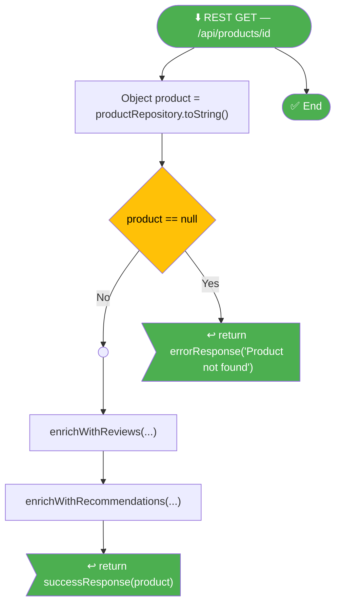

# ProductController.getProduct()

**Type:** REST GET  
**Endpoint:** `/api/products/id`  

```mermaid
flowchart TD
    N1(["⬇️ REST GET — /api/products/id"])
    style N1 fill:#4CAF50,color:#fff
    N2["Object product = productRepository.toString()"]
    N1 --> N2
    N3{"product == null"}
    style N3 fill:#FFC107,color:#000
    N2 --> N3
    N4((" "))
    N5>"↩️ return errorResponse('Product not found')"]
    style N5 fill:#4CAF50,color:#fff
    N3 -->|Yes| N5
    N3 -->|No| N4
    N6["enrichWithReviews(...)"]
    N4 --> N6
    N7["enrichWithRecommendations(...)"]
    N6 --> N7
    N8>"↩️ return successResponse(product)"]
    style N8 fill:#4CAF50,color:#fff
    N7 --> N8
    N9(["✅ End"])
    style N9 fill:#4CAF50,color:#fff
    N1 --> N9
```
