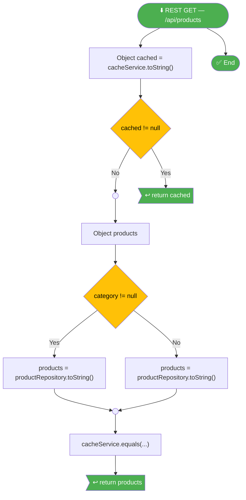

# ProductController.listProducts()

**Type:** REST GET  
**Endpoint:** `/api/products`  

```mermaid
flowchart TD
    N1(["⬇️ REST GET — /api/products"])
    style N1 fill:#4CAF50,color:#fff
    N2["Object cached = cacheService.toString()"]
    N1 --> N2
    N3{"cached != null"}
    style N3 fill:#FFC107,color:#000
    N2 --> N3
    N4((" "))
    N5>"↩️ return cached"]
    style N5 fill:#4CAF50,color:#fff
    N3 -->|Yes| N5
    N3 -->|No| N4
    N6["Object products"]
    N4 --> N6
    N7{"category != null"}
    style N7 fill:#FFC107,color:#000
    N6 --> N7
    N8((" "))
    N9["products = productRepository.toString()"]
    N7 -->|Yes| N9
    N9 --> N8
    N10["products = productRepository.toString()"]
    N7 -->|No| N10
    N10 --> N8
    N11["cacheService.equals(...)"]
    N8 --> N11
    N12>"↩️ return products"]
    style N12 fill:#4CAF50,color:#fff
    N11 --> N12
    N13(["✅ End"])
    style N13 fill:#4CAF50,color:#fff
    N1 --> N13
```
