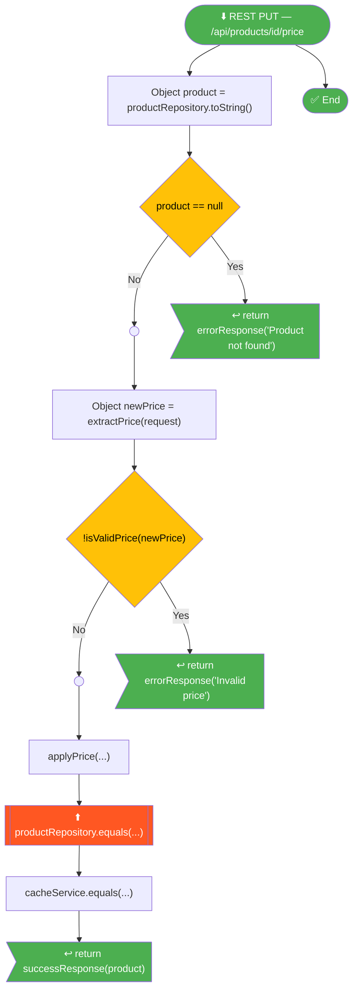

# ProductController.updatePrice()

**Type:** REST PUT  
**Endpoint:** `/api/products/id/price`  
**Outbound:** productRepository.equals(...)  

```mermaid
flowchart TD
    N1(["⬇️ REST PUT — /api/products/id/price"])
    style N1 fill:#4CAF50,color:#fff
    N2["Object product = productRepository.toString()"]
    N1 --> N2
    N3{"product == null"}
    style N3 fill:#FFC107,color:#000
    N2 --> N3
    N4((" "))
    N5>"↩️ return errorResponse('Product not found')"]
    style N5 fill:#4CAF50,color:#fff
    N3 -->|Yes| N5
    N3 -->|No| N4
    N6["Object newPrice = extractPrice(request)"]
    N4 --> N6
    N7{"!isValidPrice(newPrice)"}
    style N7 fill:#FFC107,color:#000
    N6 --> N7
    N8((" "))
    N9>"↩️ return errorResponse('Invalid price')"]
    style N9 fill:#4CAF50,color:#fff
    N7 -->|Yes| N9
    N7 -->|No| N8
    N10["applyPrice(...)"]
    N8 --> N10
    N11[["⬆️ productRepository.equals(...)"]]
    style N11 fill:#FF5722,color:#fff
    N10 --> N11
    N12["cacheService.equals(...)"]
    N11 --> N12
    N13>"↩️ return successResponse(product)"]
    style N13 fill:#4CAF50,color:#fff
    N12 --> N13
    N14(["✅ End"])
    style N14 fill:#4CAF50,color:#fff
    N1 --> N14

    %% Auto-detected outbound systems:
    %% → productRepository.equals(...)
```
